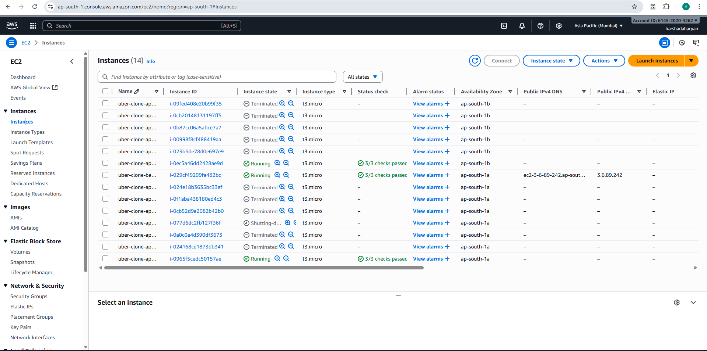

# 🚀 AWS Automated Infrastructure with Terraform

Automate the deployment of a complete AWS infrastructure using Terraform.  
This project provisions **VPC, EC2, RDS, Security Groups, and Load Balancer** using reusable modules. It’s ideal for learning **Infrastructure as Code (IaC)** and real-world cloud deployments.

---

## 📌 Infrastructure Overview

- **Bastion Host:** Secure SSH access to private instances  
- **Application Servers:** Auto Scaling group behind a Load Balancer  
- **RDS Database:** Multi-AZ deployment for high availability  


---

## 🏗️ Project Modules

### 1. VPC Module
- Custom VPC with **public and private subnets**  
- Internet Gateway & NAT Gateway for external connectivity  

  


### 2. Database Module
- **Primary DB:** MySQL RDS instance  
- **Read Replica:** Optional, for high availability & read scaling  

  


### 3. Compute & Load Balancer Module
- EC2 instances in private subnets  
- Application Load Balancer for traffic distribution  
- Bastion host for secure SSH access  



---

## ⚙️ Terraform Workflow

| Step                  | Command              | Screenshot                          |
|-----------------------|---------------------|-------------------------------------|
| Initialize Terraform  | `terraform init`     |  |
| Validate Configuration| `terraform validate` |  |
| Plan Deployment       | `terraform plan`     |  |
| Apply Infrastructure  | `terraform apply`    |  |
| View Outputs          | `terraform output`   |  |

---

## 📤 Terraform Outputs

| Output Name         | Description                                |
|---------------------|--------------------------------------------|
| `bastion_public_ip` | Public IP to SSH into Bastion Host         |
| `load_balancer_dns` | DNS endpoint for the deployed application |
| `rds_endpoint`      | Primary RDS database endpoint              |

---

## 🛠️ Technologies Used

- **Terraform:** Infrastructure as Code  
- **AWS:** VPC, EC2, RDS, ALB, Security Groups  
- **MySQL:** Database  
- **Git & GitHub:** Version Control  

---

## 🚀 Deployment Steps

```bash
# Clone repo
git clone <your_repo_url>
cd automate-infrastructure

# Initialize Terraform
terraform init

# Validate configuration
terraform validate

# Plan the infra
terraform plan

# Apply the infra
terraform apply -auto-approve

# View outputs
terraform output

✅ Key Learning Outcomes

Hands-on experience with AWS VPC, EC2, RDS, ALB

Using Terraform modules for reusable and scalable infrastructure

Implementing high-availability and secure cloud architecture

Creating well-documented, professional project reports
