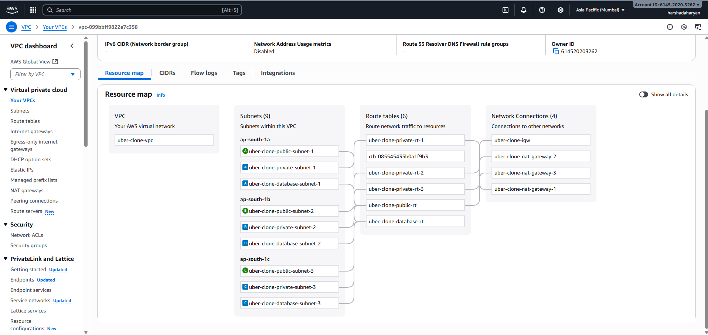
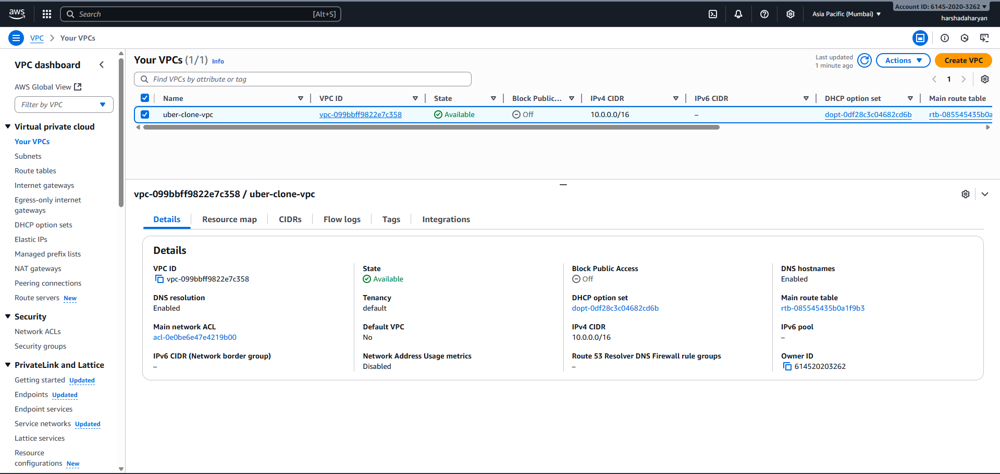
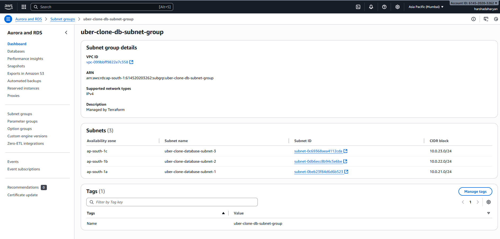

# Automate AWS Infrastructure using Terraform

---

## Introduction
This project demonstrates how to **automate AWS infrastructure deployment** using **Terraform**.  
It is designed for **learning and hands-on practice** as an AWS Engineer project.  

The project provisions the following resources:  

- **VPC** with public and private subnets  
- **EC2 Bastion Host** for secure SSH access  
- **RDS MySQL Database** (Primary + Read Replica)  
- **Application Load Balancer (ALB)** for traffic distribution  
- **Security Groups** to control network access  

The main goal is to provide a **fully automated, secure, and highly available AWS environment**.

---

## Architecture Diagram

### VPC Overview
  
  

### Database Setup
- **Primary DB:** Main MySQL RDS instance  
- **Read Replica:** Optional for read scaling and high availability  

  
  

---

## Terraform Workflow

| Step | Command | Screenshot |
|------|---------|------------|
| Initialize Terraform | `terraform init` |  |
| Validate Configuration | `terraform validate` |  |
| Plan Deployment | `terraform plan` |  |
| Apply Infrastructure | `terraform apply` |  |
| View Outputs | Terraform outputs |  |

---

## Terraform Outputs

| Output Name | Description |
|-------------|-------------|
| `bastion_public_ip` | Public IP to SSH into Bastion Host |
| `load_balancer_dns` | DNS to access the deployed application |
| `rds_endpoint` | Primary RDS database endpoint |
| `replica_endpoint` | Read Replica RDS endpoint |
| `vpc_id` | VPC ID of the deployed network |

---

## Project Folder Structure
