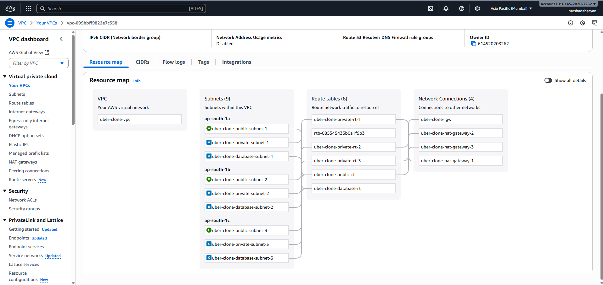
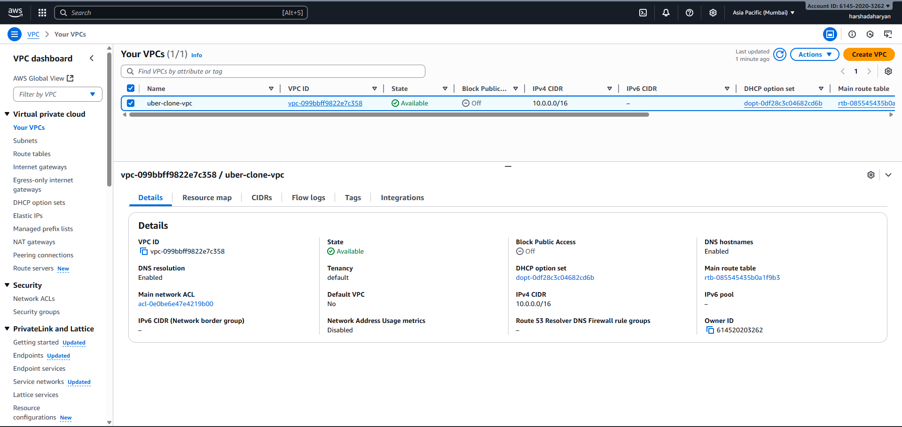
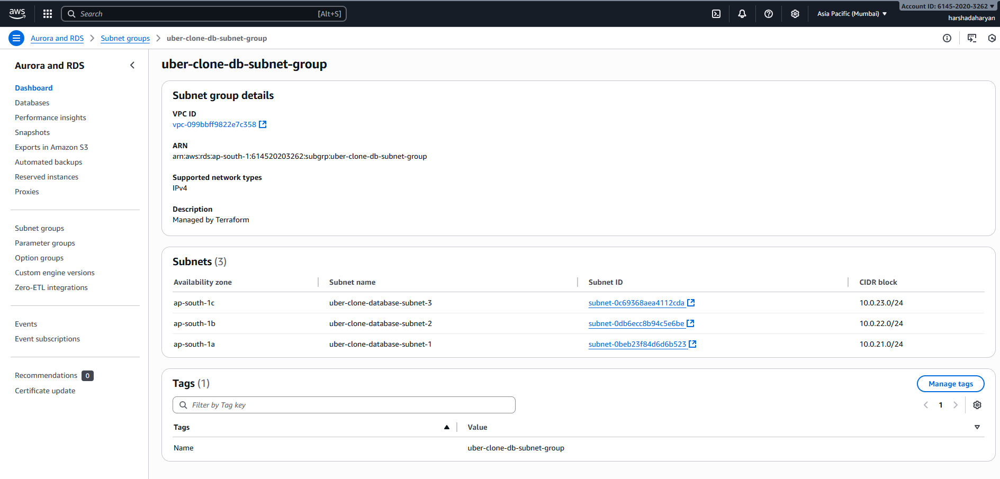
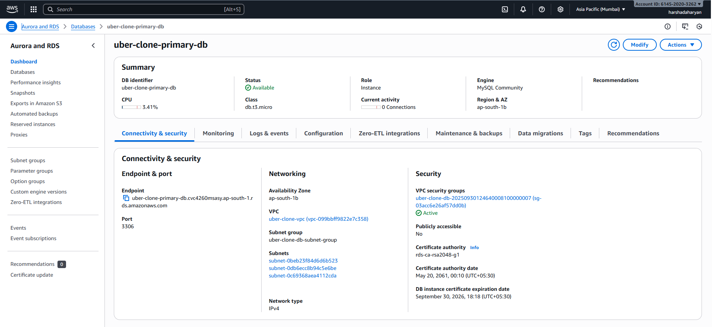
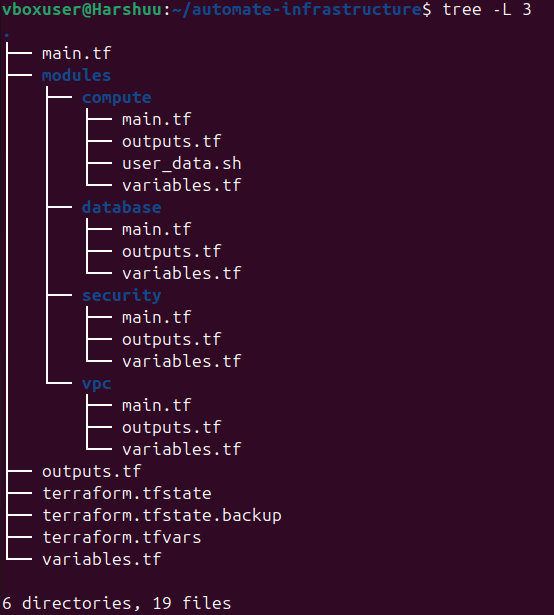
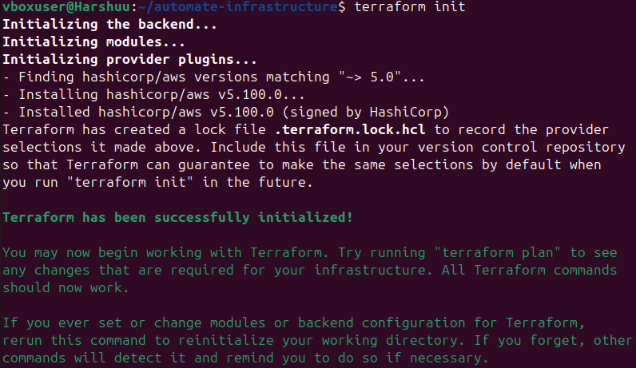
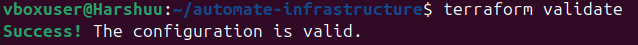
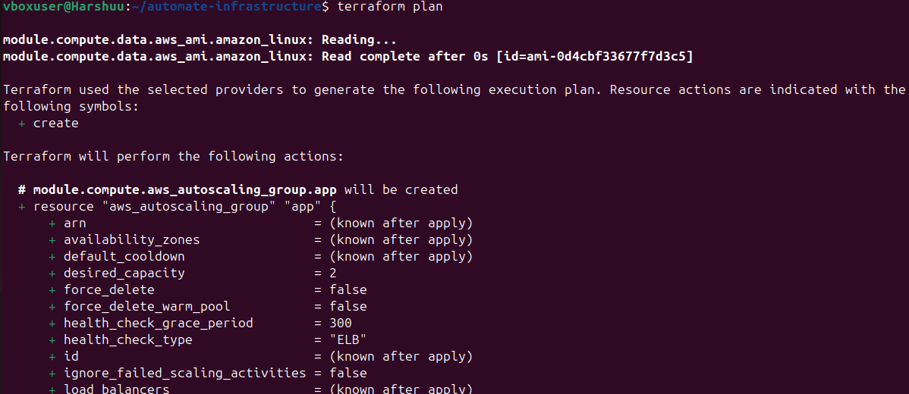
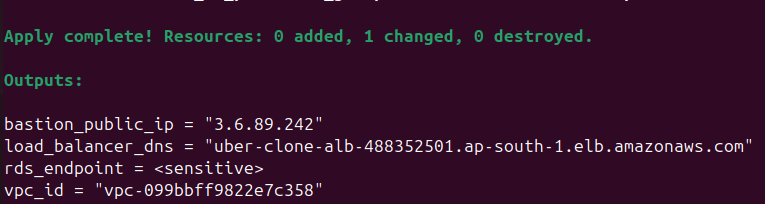
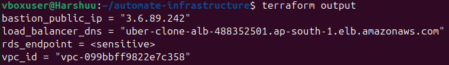

# 🚀 AWS Automated Infrastructure with Terraform

This project automates AWS infrastructure setup using Terraform.  
It provisions VPC, EC2, RDS, Security Groups, and Load Balancer with reusable modules.

---

## 📌 Project Overview

### VPC Overview
- Custom VPC with public and private subnets
- Internet Gateway and NAT Gateway for connectivity

  


---

### Database Setup
- **Primary DB**: MySQL RDS instance  
- **Read Replica**: Optional for high availability & read scaling  

  


---

### Infrastructure Overview
- Bastion Host (for SSH into private instances)  
- Application Servers (Auto Scaling behind Load Balancer)  
- RDS Database (Multi-AZ)  



---

## ⚙️ Terraform Workflow

| Step                  | Command              | Screenshot                          |
|-----------------------|----------------------|-------------------------------------|
| Initialize Terraform  | `terraform init`     |  |
| Validate Configuration| `terraform validate` |  |
| Plan Deployment       | `terraform plan`     |  |
| Apply Infrastructure  | `terraform apply`    |  |
| View Outputs          | `terraform output`   |  |

---

## 📤 Terraform Outputs

| Output Name         | Description                                      |
|---------------------|--------------------------------------------------|
| `bastion_public_ip` | Public IP to SSH into Bastion Host                |
| `load_balancer_dns` | DNS to access the deployed application            |
| `rds_endpoint`      | Primary RDS database endpoint                     |

---

## 🛠️ Technologies Used
- **Terraform** (Infrastructure as Code)
- **AWS** (VPC, EC2, RDS, ALB, Security Groups)
- **MySQL** (Database)
- **GitHub** (Version Control)

---

## 🚀 Deployment Steps
```bash
# Clone repo
git clone <your_repo_url>
cd automate-infrastructure

# Initialize Terraform
terraform init

# Validate configuration
terraform validate

# Plan the infra
terraform plan

# Apply the infra
terraform apply -auto-approve

# View outputs
terraform output

