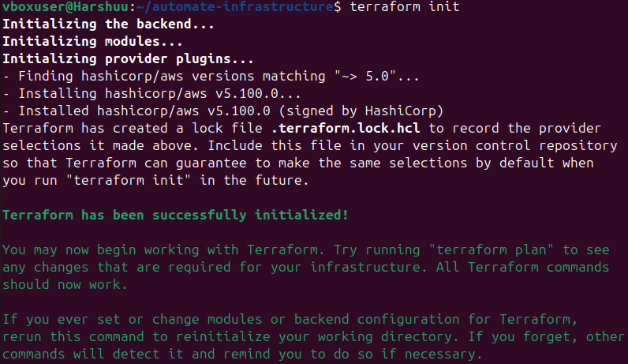
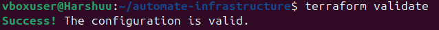
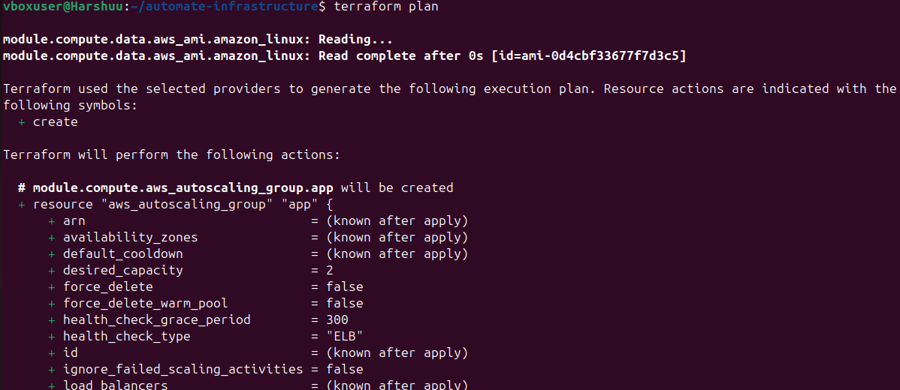
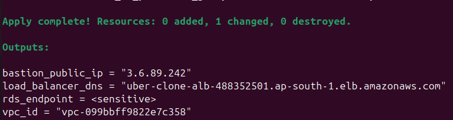
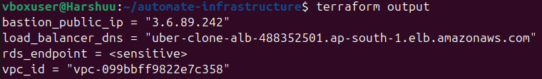

# 🚀 AWS Automated Infrastructure with Terraform

[](https://www.terraform.io/) 
[](https://aws.amazon.com/)
[](https://www.mysql.com/)
[](https://github.com/)

---

## 💡 Project Overview

This project **automates a complete AWS cloud infrastructure** using **Terraform**.  
It includes:

- **VPC & Subnets** → Secure networking architecture  
- **EC2 Instances** → Auto Scaling private servers  
- **Application Load Balancer (ALB)** → Distributes traffic  
- **RDS MySQL** → Multi-AZ high availability  
- **Bastion Host** → Secure SSH access  

This project is **production-ready**, **modular**, and **perfect for portfolio/resume showcase**.

---

## 🏗️ Architecture Diagram


---

## 🏷️ Modules & Screenshots

### 1️⃣ VPC & Networking
- Public & private subnets  
- Internet Gateway & NAT Gateway  
- Routing & security  

📸 Screenshots:  
  


### 2️⃣ Database Module
- MySQL RDS instance (Primary & optional Read Replica)  
- Multi-AZ for high availability  

📸 Screenshots:  
  
  


### 3️⃣ Compute & Load Balancer
- EC2 Auto Scaling in private subnets  
- Application Load Balancer  
- Bastion Host for secure access  

📸 Screenshot:  


---

## ⚙️ Terraform Workflow

| Step                  | Command              | Screenshot                           |
|-----------------------|----------------------|--------------------------------------|
| Initialize Terraform  | `terraform init`     |  |
| Validate Configuration| `terraform validate` |  |
| Plan Deployment       | `terraform plan`     |  |
| Apply Infrastructure  | `terraform apply`    |  |
| View Outputs          | `terraform output`   |  |

---

## 📤 Terraform Outputs

| Output Name         | Description                                |
|---------------------|--------------------------------------------|
| `bastion_public_ip` | Public IP for Bastion Host (SSH access)    |
| `load_balancer_dns` | DNS endpoint of the deployed application   |
| `rds_endpoint`      | Primary RDS database endpoint              |

---

## 🛠️ Technologies Used

- **Terraform** → Infrastructure as Code (IaC)  
- **AWS** → VPC, EC2, RDS, ALB, Security Groups  
- **MySQL** → Relational Database  
- **Git & GitHub** → Version Control  

---

## 🚀 Deployment Steps

```bash
# Clone the repository
git clone <your_repo_url>
cd automate-infrastructure

# Initialize Terraform
terraform init

# Validate configuration
terraform validate

# Plan changes
terraform plan

# Deploy infrastructure
terraform apply -auto-approve

# View outputs
terraform output

---

## 🎯 Key Skills Demonstrated

AWS Cloud Architecture → VPC, EC2, ALB, RDS

Terraform IaC & Reusable Modules → Modular, scalable infrastructure

High Availability & Fault Tolerance → Multi-AZ, Load Balancer

Secure Access Management → Bastion Host, Private Subnets

Version Control & Documentation → GitHub, professional project reportin

---

## ✅ Why This Project Stands Out

Professional portfolio-ready → Showcases cloud automation skills

End-to-end cloud deployment → Networking, compute, database

Hands-on DevOps skills → Terraform, AWS, MySQL, GitHub

